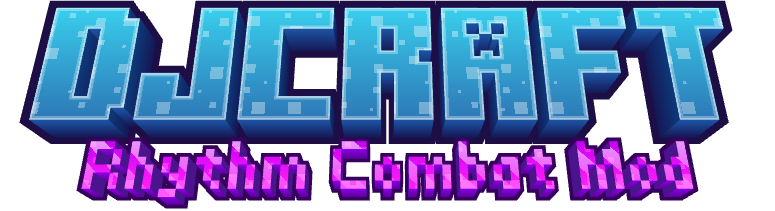

  

  <strong>简体中文</strong> | <a href="README_EN.md">English</a>

> 让音乐成为战斗节奏的 Minecraft 模组。

DJCraft 将曲目、节拍判定与 Minecraft 战斗结合起来。播放曲包后，你需要跟随谱面完成攻击、防御和移动：踩准节拍可以维持连击、积攒能量并强化战斗表现，失误则会消耗容错，甚至中断连击。

当前适用于 **Minecraft 1.21.1 + NeoForge**。

## 主要玩法

### 跟着音乐战斗

- 曲目的战斗谱面会显示在 HUD 上，可选择下落式或经典样式。
- 攻击、弓弩射击、盾牌防御和部分移动动作会接受节拍判定。
- 连续命中可提升连击、恢复能量，并获得更鲜明的 HUD、音效与动画反馈。
- 不同节拍可以带来不同的伤害表现；失误会消耗容错或打断连击。

### 收集、刻录与播放唱片

- 安装曲包，为模组加入自定义音乐和战斗谱面。
- 使用空白唱片与 DJ 工作台，将喜欢的曲目刻录成实体唱片。
- 随身音乐盒拥有 54 个唱片槽，可使用顺序播放、单曲循环和随机播放。
- 唱片会记录历史最大连击与累计播放时间。
- 当一首曲目的历史最大连击达到谱面节拍数的 80% 时，唱片会获得镀金外观。

### 节奏武器与战斗动作

DJCraft 会让原版近战、弓、弩、三叉戟、重锤和盾牌融入节拍玩法，同时加入几种特殊武器：

- **激光弩**：发射可贯穿多个目标的远程射线。
- **魔法弩**：以更高单体伤害命中首个目标。
- **冲锋弩**：发射低耗能单体射线，并可消耗药箭传递药水效果。
- **爆炸弓**：自动蓄力并在命中处制造不破坏地形的范围爆炸。
- **盾牌招架**：在合适时机举盾可以化解伤害，并获得连击与能量奖励。

特殊射线武器目前主要通过创造模式获取。

### 高机动 DJ 战斗

活跃的 DJ 会话中，玩家可以使用：

- 八方向冲刺；
- 空中多段跳；
- 空中下砸与范围击飞；
- **Flowery** 强化冲刺，以彩虹残影撞击敌人。

此外还有 DJ Fumo、能量手环和瓶中音符等被动物品，可提升容错、能量上限或空中跳跃次数。

### 多人 DJ 组网

- 邀请在线玩家加入共享播放组。
- 全队同步播放同一歌单，并支持中途加入和房主转交。
- 每名玩家保留独立的连击、能量、容错与战斗状态。
- 缺失的可分发曲包可以从服务器下载并完成校验。

### 电子血宫

从 DJ 工作台进入 **电子血宫（Cyber Grind）**，选择随身音乐盒中的歌单，在音乐中迎战不断推进的敌人波次。

- 支持单人挑战和 DJ 组网共同准备。
- 在独立午夜竞技场中战斗，波次会根据存活玩家数量调整。
- 怪物不会掉落战利品或经验，也不会破坏竞技场地形。
- 玩家被击败后会安全返回入场前的位置，并保留背包与经验。
- HUD 会显示倒计时、当前波次和场上敌人压力，并分别记录个人与组队最佳成绩。

## 快速开始

1. 安装 DJCraft、NeoForge 与模组所需依赖。
2. 将可用曲包放入游戏目录的 `djcraft/trackpacks/`。
3. 制作空白唱片、DJ 工作台与随身音乐盒。
4. 手持空白唱片右键 DJ 工作台，选择曲目完成刻录。
5. 将唱片放入随身音乐盒，普通右键或按默认 `G` 键打开播放器。
6. 播放音乐，观察谱面并跟随节拍战斗。

默认 `V` 键用于 DJ 冲刺；其他操作沿用对应物品和动作的原版按键。

## 多人游玩提示

多人服务器会检查双方曲包内容是否一致。若曲包缺失或版本不同，需要先下载或重新安装正确版本，才能进行刻录、播放和组网。服务端提供可分发曲包时，可直接在模组下载界面处理。

## 当前状态

DJCraft 仍在持续开发中。音乐同步、第一人称动画、多人组网和电子血宫等功能对实际游戏环境较为敏感；如遇问题，请记录使用的曲包、单人或多人环境以及复现步骤。

## 更多文档

- [游戏机制说明](docs/gameplay-mechanics.md)
- [曲包说明](docs/trackpack-feature.md)
- [文档索引](docs/README.md)

## 许可

本项目源代码按 [Mozilla Public License 2.0](LICENSE) 发布。

MPL 2.0 适用于本项目的受许可源代码；第三方依赖、Minecraft/NeoForge 内容及其他外部资源仍受其各自许可证约束。分发修改后的源代码或构建产物时，请一并保留适用的许可证与版权声明。
