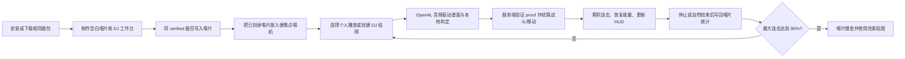

# DJCraft 游戏机制与实现文档

> 适用版本：DJCraft 2.1.1、Minecraft 1.21.1、NeoForge 21.1.218；代码核对日期：2026-08-02。
> 本文是玩家可见玩法、规则结算和运行时实现的总览。曲包字段、资源文件格式、数据包
> Schema 和 Java 扩展签名分别以对应专项文档为准。

相关文档：[文档索引](README.md) · [曲目包格式](trackpack-feature.md) ·
[资源包](resource-pack.md) · [数据包](data-pack.md) · [附属 Mod 接口](addon-api.md)

## 目录

1. [文档边界与核心原则](#scope)
2. [核心游戏循环](#core-loop)
3. [内容获取、曲包验证与下载](#content)
4. [唱片刻录与便携点唱机](#disc)
5. [播放列表与 DJ 会话生命周期](#session)
6. [时间模型、节拍事件与判定](#timing)
7. [连击、容错与能量](#resources)
8. [物品冷却、切换前摇与通用战斗规则](#combat-common)
9. [武器专用机制](#weapons)
10. [盾牌与招架](#shield)
11. [移动能力与 Flowery 冲刺](#movement)
12. [被动物品与获取方式](#passives)
13. [HUD、声音与第一人称反馈](#feedback)
14. [DJ 组网](#group)
15. [唱片统计与镀金](#statistics)
16. [服务端权威、同步与反作弊](#authority)
17. [配置、命令与数据驱动边界](#operations)
18. [未完成能力与验证边界](#limitations)
19. [主要实现索引](#implementation-index)

<a id="scope"></a>

## 1. 文档边界与核心原则

本文集中描述以下内容：

- 玩家如何取得内容、刻录唱片、开始和结束 DJ 会话；
- 音频时间如何变成节拍判定、冷却和动画时间；
- 连击、容错、能量、攻击、盾牌和移动能力如何结算；
- 个人播放、多人组网、HUD、唱片统计和镀金如何工作；
- 每项机制由客户端还是服务端拥有，以及对应的主要代码路径。

专项文档继续承担格式契约：

| 问题 | 权威文档 |
|---|---|
| `track.json` 字段、曲包目录、哈希、压缩包安全 | [曲目包格式](trackpack-feature.md) |
| HUD/声音/动画资源路径与 JSON | [资源包](resource-pack.md) |
| 物品时序、行为 Profile、标签、配方、战利品 | [数据包](data-pack.md) |
| 事件、公开类型、查询入口和附属 Mod 边界 | [附属 Mod 接口](addon-api.md) |

DJCraft 的运行时遵循四个核心原则：

1. **音频决定客户端节奏。** 客户端判定、谱面和第一人称动画读取 OpenAL 播放位置，
   不用帧数或普通墙钟代替。
2. **服务端决定玩法结果。** 伤害、能量、连击、容错、移动、唱片身份和组网状态均由
   服务端重新校验或结算。
3. **每个动作只有一个序列身份。** 普通攻击即使命中多个实体也最多增加一次连击；招架和 DJ 三叉戟
   右键投掷是例外，前者每次挡下伤害增加连击，后者每次实际造成伤害增加连击；
   重放或乱序的 action sequence 会被拒绝。
4. **内容必须一致。** 多人玩法只允许客户端与服务端完整内容 SHA-256 一致的曲包进入
   刻录、播放和组网主流程。

<a id="core-loop"></a>

## 2. 核心游戏循环



一局 DJ 玩法的最小闭环是：

1. 服务端和客户端加载同一个曲包。
2. 玩家手持空白唱片右键 DJ 工作台，选择一个已验证曲目完成刻录。
3. 玩家将唱片放入便携点唱机，打开播放器并开始播放。
4. 会话期间，攻击、专用武器、盾牌和移动能力在 `combat_line` 上判定。
5. 成功造成伤害或完成招架可增加连击；连击推动能量获取和 HUD 强度。
6. 会话停止后，物理唱片记录历史最大连击与累计有效播放时长。

<a id="content"></a>

## 3. 内容获取、曲包验证与下载

### 3.1 本地内容

曲包从游戏目录 `djcraft/trackpacks/` 加载，支持目录包和 `.djcraft` ZIP 归档。
曲包至少包含根目录 `track.json` 和有效 Ogg Vorbis 音频。具体结构、字段和安全限制见
[曲目包格式](trackpack-feature.md)。

`/dj reload` 重扫服务端外置曲包并向在线玩家重新同步哈希；它不等于 Minecraft
数据包命令 `/reload`。客户端播放器和刻录界面还提供打开曲包目录、重载本地曲包和下载页。

### 3.2 多人 verified 状态

玩家登录或服务端重载后，服务端发送 `packId → 完整内容 SHA-256`。客户端把它与本地
曲包计算结果比较：

| 状态 | 含义 | 可否刻录/播放 |
|---|---|---|
| verified | ID 和完整内容哈希都一致 | 可以 |
| missing | 服务端存在、本地缺失 | 不可以，需下载/安装 |
| mismatch | ID 相同但内容不同 | 不可以，需重新下载或修正 |
| client-only | 只在客户端存在 | 不进入当前服务端可用列表 |

完整内容哈希覆盖曲包内每个文件的相对路径、长度和内容，不只覆盖 `track.json`。
因此音频、贴图或附属 Mod 私有文件变化也会使曲包失去 verified 状态。

### 3.3 下载行为

下载页支持下载、重新下载、暂停、恢复、进度、平均速度和错误状态。只有 `.djcraft`
归档可以由服务端分发；目录包可在服务端使用，但不能自动下载。

管理员 `/dj play` 会先要求目标客户端预检资源。缺失或不一致时，客户端自动下载可分发
归档，完成安装和最终哈希回报后才创建会话。普通玩家也可使用：

```text
/djclient download <trackpack>
```

默认压缩和解压大小上限均为 256 MiB，可通过 `maxTrackPackDownloadMiB` 调整。
分块、窗口 ACK、归档哈希和 ZIP 安全细节见曲目包文档。

<a id="disc"></a>

## 4. 唱片刻录与便携点唱机

### 4.1 空白唱片与刻录

`djcraft:empty_disc` 既是空白唱片物品，也是已刻录唱片的物品类型，堆叠上限为 1。
核心设备和空白介质均使用无序合成：

| 输出 | 输入 |
|---|---|
| 空白唱片 | 两个唱片碎片，或任意一个 `minecraft:music_discs` 标签成员 |
| DJ 刻录台 | 工作台 + 音符盒 |
| 便携点唱机 | 一个音符盒 |

玩家手持尚未刻录的空白唱片右键 `djcraft:dj_crafting_table` 后，客户端显示 verified
曲目列表。服务端收到选择后重新检查：

- 目标方块仍是 DJ 工作台；
- 玩家距方块中心不超过 8 格；
- 请求手仍持有未写入曲目 ID 的空白唱片；
- 服务端仍加载该曲包；
- 客户端已回报匹配的完整内容哈希。

成功后写入三个数据组件：

| 组件 | 用途 |
|---|---|
| `djcraft:track_pack_id` | 曲目包 ID |
| `djcraft:disc_id` | 唯一物理唱片 UUID |
| `djcraft:disc_statistics` | 历史最大连击和累计播放时长 |

客户端请求只负责表达玩家选择；唱片身份和初始统计由服务端创建。

### 4.2 便携点唱机

`djcraft:portable_jukebox` 使用原版 `CONTAINER` 数据组件持久化 54 个槽位。

- 下蹲右键：打开 9×6 存储界面；
- 普通右键：打开 ModernUI 播放器；
- 默认 `G` 键：搜索玩家物品栏中的第一个便携点唱机并打开播放器。

存储槽只接受带 `track_pack_id`、且曲目在当前侧已经加载的 DJCraft 唱片。空白唱片或
指向未加载曲目的唱片不能放入。播放器保持点唱机槽位顺序和重复曲目，不按曲目 ID 去重；
当前服务端未验证的唱片会被隐藏。

播放器提交的是“物理唱片引用”，包含曲目 ID、唱片 UUID、点唱机所在玩家物品栏槽位和
唱片内部槽位。服务端会按 UUID 重新定位并验证实体物品，不能只凭客户端给出的曲目 ID
播放任意歌曲。

<a id="session"></a>

## 5. 播放列表与 DJ 会话生命周期

### 5.1 个人播放

播放器有三种模式：

| 模式 | 自然结束后的选择 |
|---|---|
| 顺序播放 | 下一槽，末尾回到第一槽 |
| 单曲循环 | 当前槽 |
| 随机播放 | shuffle bag 走完所有槽后重填；存在其他曲目时避免立即重复同曲 |

重复曲目仍是独立槽位和独立唱片引用。播放请求 5 秒内没有获得会话启动确认时，客户端清理
待处理状态；外部命令启动的会话不会错误继承旧播放列表。

### 5.2 启动流程

个人播放的实际流程为：

1. 客户端从点唱机轮播中选择一个物理唱片引用。
2. 服务端检查曲包和客户端 verified 状态，并重新定位唱片。
3. 若已有个人会话，先停止旧会话并再次解析唱片，避免停止写回统计后使用过期引用。
4. 服务端创建唯一 session ID 和 `DJSession`，客户端创建 `DJSessionClient`。
5. 客户端从 `playback_start_ms` 启动 OGG；晚加入组网时从更晚的组时钟位置启动。
6. OpenAL source 就绪时，以服务端发送位置、半 RTT 估算和本地完整缓冲耗时计算 seek；若已越过配置终点，则钳制到终点前 1ms。
7. 客户端回报 seek 后的实际播放位置，服务端建立时钟偏移。
8. 服务端发送能量、连击、容错、连续冲刺次数、冲刺冷却和剩余空中跳跃快照。

客户端成功建立会话后会显示约 5 秒的成就式“正在播放”提示。提示图标使用当前曲目的
唱片物品模型（包括曲目包提供的 `disc.png`），名称优先使用曲目包
`meta.display_name`，缺失或为空时回退到曲目包 ID。音频不可用、曲目未验证或曲目包缺失而
未能建立会话时不会显示提示。

### 5.3 停止与自然结束

下列情况会停止会话：

- 玩家在播放器中手动停止或使用 `/dj stop`；
- 切歌；
- 原始播放位置到达 `total_duration_ms`；
- 音频自然结束；
- 玩家死亡或退出；
- 服务端停止；
- 连续五次时钟异常触发强制停止。

个人播放自然结束时按当前播放模式推进。死亡会结束个人会话；组网成员死亡不会退出组网，
重生后会从组内当前播放位置恢复。

连击、能量、容错次数和容错恢复进度在同一服务器运行期内跨会话保留。
服务器关闭时这些内存态资源被清理。

<a id="timing"></a>

## 6. 时间模型、节拍事件与判定

### 6.1 三种时间

设原始音频播放位置为 `P`，曲目整体校准为 `offset_ms`，则：

```text
timelineTime = max(0, P - offset_ms)
```

| 时间/坐标 | 用途 |
|---|---|
| 原始播放位置 `P` | OGG seek、`playback_start_ms`、`total_duration_ms`、有效统计区间 |
| 时间线时间 | `combat_line[].t`、客户端判定、服务端 proof 复算、节拍事件 |
| 虚拟拍 | 由相邻 `combat_line` 事件插值得到；用于拍数冷却、切换前摇、盾牌持续费和动画 |

有效原始播放区间为：

```text
[playback_start_ms, total_duration_ms)
```

`total_duration_ms` 是排他结束位置，不是从播放起点再加的持续时长。开始位置或组网追赶
位置之前的事件会标记为已经过，不会在会话启动时集中补触发。

`meta.bpm` 当前只用于 UI、命令和日志；判定、虚拟拍和冷却直接使用显式
`combat_line`，不会按 BPM 自动生成节拍。

### 6.2 客户端和服务端时钟

客户端 `DJSessionClient` 优先读取 OpenAL source 的实际播放位置。声音事件按确切
`DJSoundInstance` 身份绑定 OpenAL channel；停止清理还会同时校验 channel 身份与 source ID，
因此切歌后迟到的旧实例或旧 channel 停止回调不能清除新曲绑定、占用新曲 source 或恢复播放。
source 尚未就绪或读取失败时，时间冻结在最后一次有效值，不回退到墙钟。非循环音源自然结束时
OpenAL 可能在 Channel 销毁前短暂把位置重置为 0；该明显倒退样本不会覆盖最后有效位置，曲尾仍按
自然结束处理。谱面、判定、动画和自然结束检测因此与
玩家实际听到的音频保持同源。游戏未暂停时，如果主音量或唱片音量被设为 0，或者 OpenAL
source 暂停、停止、意外丢失，客户端会把它视为音频异常；个人会话立即退出，组网会话按
当前播放 ID 请求恢复。等待 source 超过 30 秒也属于音频异常；
source 即使仍报告 `PLAYING`，只要播放位置连续 1 秒没有前进也执行相同强退。冻结值不能
继续用于节拍判定。正常打开单人暂停菜单不会触发该异常退出。

独立会话的服务端使用单调 `StandaloneDJServerClock`；集成单人会在客户端 ready 后允许
向后对齐，以适配暂停菜单同时冻结音频和集成服务器。组网成员的服务端会话共享
`GroupPlaybackClock`，但各客户端仍以自己的 OpenAL source 驱动渲染与判定。

### 6.3 最近节拍判定

`BeatJudgmentEvaluator` 在排序后的 `combat_line` 中二分查找当前时间前后的事件，并选择
距离更近者；距离相等时选前一个。然后应用 `TrackPack.resolveDefinition(event)` 得到
事件 `props` 覆盖后的有效 definition。

- `can_attack=false`：默认使行为判定为 Miss；注册行为可把 `disabledByCanAttack` 设为
  `false` 以忽略此门。内置盾牌、挖掘、进食、冲刺、二段跳和下砸采用该设置；其他行为继续使用默认门；
- 普通近战攻击按独立注册的 `djcraft:melee` 行为判定；其 `disabledByCanAttack=true`，因此
  `can_attack=false` 时为 Miss。盾牌左键使用 melee 策略，右键举盾使用 shield 策略；由
  `trident`/`mace` family 接管的范围左键则使用该物品实际注册行为的策略；
- `tolerance > 1`：直接解释为正负毫秒窗口；
- `tolerance <= 1`：解释为相邻节拍间隔的比例；
- 单个孤立节拍或缺少对应一侧相邻事件时使用 500 ms 基准间隔；
- `abs(timelineTime - beat.t) <= toleranceMs` 时为 Hit，边界包含在窗口内。

只调度 `timeline.combat_line`。其他命名轨会被解析和哈希，但当前没有运行时效果调度器。

### 6.4 proof

客户端每次需要服务端结算的动作发送：

```text
sessionId + actionSequence + claimedHit + clientTimeMs + beatIndex
```

服务端使用相同曲包重新判定 `clientTimeMs`。只有客户端声明 Hit、服务端也判为 Hit 且
beatIndex 相同时才保留 Hit；任何不一致都会降级为 Miss。曲目的类别、容差和其他结算数据
始终取服务端 definition。

<a id="resources"></a>

## 7. 连击、容错与能量

### 7.1 连击

连击由服务端 `DJSessionResourceState` 保存，初始为 0。

- 一次成功伤害 action sequence 默认最多增加 1 连击；
- 区域攻击或穿刺投射物命中多个实体默认仍只增加 1；DJ 三叉戟右键投掷按每次实际伤害分别增加；
- 招架窗口内每次成功挡下的伤害都增加 1 连击并照常触发连击增益，但整次举盾只返还一次招架能量；
- 仅判定 Hit、却没有实际造成伤害的普通攻击不会增加连击、能量或命中奖励；该判定所在节拍不计入空闲断连计数，但不会刷新最后命中基准，同一节拍也只能排除一次；
- 连击增长至 2–48 之间的偶数时，每次恢复 1 点食物值和 1 点饱和度；连击达到 50 后，
  每增长 1 连击都恢复一次。两项均按原版上限截断，多目标共享 sequence 时不会重复回复；
- 连击每增长至 10 的倍数时，给予 30 秒伤害吸收 II；到达后续 10 的倍数会重新给予并刷新时长；
- 管理员 `/dj set combo` 会更新当前值、当前曲目连击、当前曲目最大值和空闲重置基准；
- 连击在会话切换/结束后保留；新曲目的“当前曲目连击”从 0 开始，只记录该曲目内连续获得的连击。

连击增长后的能量奖励按增长后的档位计算：

| 新连击值 | 每次确认伤害命中的奖励 |
|---|---:|
| 1–9 | +1 能量 |
| ≥10 | +2 能量 |

招架只给予固定 +5 能量，不再叠加上表的普通命中奖励。

### 7.2 Miss、容错与空闲重置

基础容错上限由 gamerule `djcraftBaseMaxToleranceChances` 控制，默认 2，运行时限制为
0–16；DJ Fumo 在该基础上再增加 1。服务端确认一次需要记录的 Miss 时：

1. 若仍有容错次数，消耗 1 次并保留连击；
2. 否则把连击重置为 0；
3. 同一或更旧 action sequence 不会重复消耗容错或再次结算。

容错在活跃会话中按 `toleranceRechargeTicks` 恢复，默认每 80 tick 恢复 1 次，直到
当前最大值。剩余次数与恢复进度跨歌曲保留。

并非所有本地“Miss”提示都会进入连击惩罚：

| 动作 | Miss 是否交给服务端容错/连击状态 |
|---|---|
| 普通近战、三叉戟/重锤左键 | 是 |
| 弓释放、弩发射、风弹、三叉戟投掷 | 是 |
| 弓开始蓄力 | 是；与释放使用不同 action sequence |
| 冲刺、多段跳、下砸、盾牌开始 | 否；它们使用非攻击 proof 和各自的门控/代价 |

即使玩家没有主动 Miss，连击也会因长期没有确认命中而结束。gamerule
`djcraftIdleAttackableBeatsBeforeComboReset` 默认 5、最小 1；从最后命中的节拍索引起，经过相应数量
的可攻击节拍时重置，`can_attack=false` 的事件不推进该计数。DJ Fumo 额外增加 2 拍宽限。

gamerule `djcraftOffBeatAttackDamagePercent` 控制合法攻击 Miss 的剩余伤害，默认 50，运行时限制为
0–100。0 保持直接取消；大于 0 时近战、弓、弩/trigger、射线、三叉戟投掷和自动蓄力攻击仍可执行，
以原版最终伤害乘该百分比，且不应用 weakbeat/downbeat 类别倍率。该攻击仍消耗一次容错或断连、
支付正常能量/弹药/耐久/冷却，但不增加连击、不奖励命中能量、不刷新空闲基准，也不广播
`target_hit` 命中确认音。非法来源、冷却、proof 或资源校验失败不会被该 gamerule 放行。

### 7.3 能量

`djcraft:max_energy` 玩家属性默认 50，合法范围 0–1024。普通玩家第一次进入会话时能量为
0，之后在同一服务器运行期跨会话保留并按当前最大值截断。

自动恢复规则：

| 当前连击 | 被动恢复 | 命中恢复 |
|---|---|---|
| 0–4 | 每 10 tick +1 | 每次 +1 |
| 5–9 | 每 5 tick +1 | 每次 +1 |
| ≥10 | 每 5 tick +1 | 每次 +2 |

恢复和奖励都不能超过动态最大能量。创造模式玩家在会话开始和每 tick 保持满能量；合法动作
仍经过消费校验，但消费后立即补满。

一般规则是：动作先通过服务端会话、物品、冷却和判定检查，再原子扣费；余额不足时不执行
玩法效果。被 `djcraftOffBeatAttackDamagePercent` 放行的攻击 Miss 支付正常攻击/使用能量；被取消的
多数攻击 Miss 不扣能量。冲刺 Miss 仍执行并扣费，盾牌 Miss 仍可进入普通
格挡并支付起始费用，详见后文。

<a id="combat-common"></a>

## 8. 物品冷却、切换前摇与通用战斗规则

### 8.1 DJ 冷却

物品 Profile 可以分别配置左键 `beat_cooldown` 和右键 `use_beat_cooldown`。未配置
`beat_cooldown` 时按物品主手攻击速度换算：

| 最终攻击速度 | 默认冷却 |
|---:|---:|
| ≥1.5 | 1 拍 |
| ≥1.0 | 2 拍 |
| ≥0.6 | 3 拍 |
| <0.6 | 4 拍 |

普通攻击通常使用 `max(0, beat_cooldown - 0.4)` 拍，右键触发型动作使用
`max(0, use_beat_cooldown - 0.4)` 拍作为实际物品冷却，0.4 拍是现有宽容量。缺少
`use_beat_cooldown` 时回退到该物品最终的 `beat_cooldown`，旧数据包行为不变。虚拟拍由当前曲目
的显式节拍网格换算为 tick，因此变速谱面中的实际秒数会随局部节拍间隔变化。

服务端会话临时给玩家攻击速度增加 100 点，使原版攻击强度不再成为主要节奏门；真正的
出手节奏由 DJ 冷却、客户端输入拦截和服务端 proof/冷却校验控制。退出会话时移除修饰符。

### 8.2 切换前摇

`switch_warmup` 未配置时回退到最终 `beat_cooldown`。新物品进入主手或副手时：

- 仅当该物品当前剩余冷却短于前摇时才用前摇覆盖；相等或更长的现有冷却保持不变；
- 播放独立的换出/换入动画；
- F 键换手按进入物品的冷却拍处理，同时保持两只手动画状态隔离；
- 空手普通攻击在 DJ 会话中被取消。

前摇、左右键冷却、攻击能耗和使用能耗由服务端数据包 Profile 产生完整快照，并在登录和
`/reload` 后同步给客户端。客户端值用于即时 UI/输入预检，服务端值用于最终结算。

### 8.3 伤害类别

节拍 definition 的 `category` 与服务端物品标签共同决定伤害倍率：

| 类别 | 普通武器 | 匹配标签 | 匹配后 |
|---|---:|---|---:|
| `normal` | 100% | 无 | 100% |
| `weakbeat` | 50% | `djcraft:swift` | 100% |
| `downbeat` | 100% | `djcraft:smash` | 150% |

内置 `swift`：金剑、三叉戟。内置 `smash`：重锤、三叉戟。数据包可以扩展或替换标签。
服务端以攻击/发射瞬间的实际物品栈判定标签；客户端同规则只用于即时选择
`matched_hit_behavior` 视觉，不能决定最终伤害。

### 8.4 通用近战

主手非空普通攻击在客户端先判定；攻击 payload 只携带 proof、手、动作来源槽位和物品 ID，不再
携带或信任客户端目标。服务端 Hit 后锁定当时视角、攻击强度、来源物品和近战参数，立即播放一次
挥手，并开启攻击窗口：普通攻击持续 2 tick，`djcraft:mace` 行为的左键持续 4 tick。开启时先做
零位移检测，之后逐 tick 连续扫掠上一眼睛位置到当前眼睛位置。窗口内旋转视角不会改变本次攻击
方向，镜头也不会被目标吸附。

普通近战默认使用轴向距离 `4.25`、水平 `±30°`、垂直 `±20°` 的截断前向锥体。每次扫描先选择
准星射线直接穿过碰撞箱的合法目标，再选择角度最接近准星的候选；首次接触后只结算该目标并关闭
窗口。两 tick 都没有目标时只保留正常挥空。合法目标必须存活、可攻击、可见、非自身/友军，符合
世界边界和 PvP/创造/旁观限制；墙体会阻止捕获。独立原版实体攻击包在 DJ 会话中一律拒绝，只有
窗口管理器短暂授权的 `Player.attack` 可以进入伤害流程。

执行目标攻击期间临时绑定动作来源槽位以及该物品的主手属性修饰符，返回后恢复玩家已经切换到的
槽位和已应用属性。
这一步不依赖原版下一 tick 的装备检测，避免秒切时 `ATTACK_DAMAGE` 等缓存属性来自另一件物品；
判定、目标和旧武器也不再依赖两个网络包的到达顺序。攻击方块改走独立的
`djcraft:mining` 非攻击判定，不会误记为近战攻击。
服务端只给当前事务中匹配 session、
sequence 和 TTL 的 pending judgment 放行伤害：

动作来源在原始鼠标/键盘攻击键按下时捕获，而不是等到 `startAttack()` 的交互事件。原版会在
同一 `handleKeybinds()` 中先应用数字键快捷栏切换、再触发攻击；提前捕获确保同 tick 的数字键
秒切仍使用按下攻击时的旧武器。攻击输入只由统一战斗处理器施加一次冷却：攻击冷却归动作来源
武器，切换后的物品只按自身 `switch_warmup` 进入前摇。所有客户端 DJ 冷却共用同一 Session 时间
结束点跟踪，因此前摇比较会包含刚施加的攻击/触发冷却。滚轮切换会立即生效，因此滚轮与攻击按键
按实际回调先后决定来源。

### 8.5 挖掘与进食

DJ 模式中每次物理按下左键且命中方块时，先用交互发生时的实际主手和目标方块调用
`DJMiningRules.isMiningIntent` 分类。只有 `ItemStack.isCorrectToolForDrops` 为真才按内置
`djcraft:mining` 行为判定；剑打偏到普通方块、错误工具或空手均按普通攻击判定，并取消这次按住
期间的原版方块破坏输入。持续按住合格工具不会重复取拍或连续触发秒挖，服务端还按 session 与
beat index 限制同一拍最多成功秒挖一个方块。
每次实际取拍同时在主手播放通用 `melee_strike` 攻击动画，但不额外派发武器攻击音效。Hit 时，
服务端重新校验会话 proof、
交互距离、世界保护与当前主手工具；只有 `ItemStack.isCorrectToolForDrops` 对目标方块为真才立即按
原版 `ServerPlayerGameMode.destroyBlock` 流程破坏方块，因此仍触发方块破坏事件、掉落和工具耐久。
挖掘判定 Miss 时不提供秒挖，合格工具的原版持续挖掘仍可继续。

食物实际开始使用后按内置 `djcraft:eating` 行为判定。由于客户端判定包可能先于原版使用包到达，
Hit 会在服务端短暂挂起，待服务端确认玩家用同一只手和同一物品进入进食状态后，再立即运行原版
食物完成与 NeoForge finish hook；Miss 时保持原版进食时长。两种行为均为
`disabledByCanAttack=false`，所以 `can_attack=false` 节拍仍可命中，但仍必须处于节拍容差窗口。

- 没有当前匹配判定：取消伤害；
- 判定 Miss：结算一次 Miss；剩余伤害 gamerule 为 0 时取消，否则按其百分比执行；
- 判定 Hit：按节拍类别修改实际伤害；
- `attack_energy_cost` 在获准执行伤害后、伤害前扣除；
- 只有节拍 Hit 且目标实际受伤后才确认连击、命中能量和 `target_hit` 音效。

同一 action sequence 的多目标伤害默认会去重连击，但每个目标仍可收到各自的合法伤害；DJ 三叉戟
右键投掷是例外，每次实际伤害都增加 1 连击。
能量、类别标签倍率、声音身份和后续投射物上下文均从动作快照读取，不从结算时的当前手持物
重新推断。来源槽位必须是当前选中槽，或服务端刚处理的切换动作所记录的旧槽；客户端不能借此
声明任意未选中的快捷栏物品。

### 8.6 非玩家来源攻击延后

处于活跃 DJ 会话的玩家受到有实体造成者、且造成者不是玩家的攻击时，服务端取消当次即时伤害，
并把原始 `DamageSource` 与原始伤害排到受击时刻之后的下一枚 combat-line 节拍。怪物近战和怪物
投射物属于该范围；玩家近战、玩家投射物以及没有实体造成者的摔落、燃烧等环境伤害保持原流程。
分类使用 `DamageSource.getEntity()` 表示的真正造成者，不按投射物等直接实体分类。

延后至少跨过一拍：若受击时位于任一节拍的判定窗口内，以该窗口所属拍为基准，排到其后一拍；
这也适用于尚未到达拍点的左侧半窗，不能把窗口所属拍本身误当成下一拍。若不在判定窗口内，
以时间线上严格晚于受击时刻的拍为第一拍，再排到其后一拍（下下拍）。结算点是目标拍右侧判定
窗口的结束时间：绝对 `tolerance` 直接按
毫秒，比例 `tolerance` 按该拍之后的相邻节拍间隔换算；最后一拍回退到前一间隔，单拍谱面回退到
500 ms。当前是否处于窗口和目标拍边界都使用事件 `props` 覆盖后的 definition；窗口归属判定仍
包含 `can_attack=false` 节拍，但延后伤害的目标拍必须满足 `can_attack=true`。若初选目标拍禁用攻击，
则逐拍后移到下一枚可攻击节拍；若谱面剩余节拍中没有可攻击目标，则攻击不延后。服务端在会话时间
首次达到或越过结算点的 tick，按入队顺序重新执行完整伤害流程。

每条重放前会清除原版受伤无敌帧，因此同一窗口积累的攻击不会因集中到同一 tick 而互相吞掉；
重放时的盾牌、DJ 招架、伤害免疫和其他 Mod 伤害事件仍可阻止伤害。会话停止、自然结束或被新会话
替换时，仍在线且存活的玩家会在下一服务端 tick 立即收到全部待处理攻击；死亡或退出会清空队列。
每次攻击成功入队时，服务端向受击玩家发送一次专用提示 payload；客户端收到后不再重复校验
本地 session 状态，并以无距离衰减的 UI 音效播放 `djcraft:combat.deferred_damage`（资源文件为
`assets/djcraft/sounds/combat/hurt.ogg`）。服务端另行同步
队列是否为空：只要当前会话仍有任意未触发延后伤害，Falling 的虚线与进度充能条以及 Legacy
判定线都保持黄色；最后一条伤害被取出后恢复原色，不由客户端时间估算。黄色状态优先于短暂的
命中/未命中判定线反馈色。

成功进入可用的盾牌弹反状态时，服务端会在激活弹反状态之后立即取出当前会话中符合弹反资格的
延后伤害并逐条重放；不符合资格（包括来源位于玩家背后）的伤害继续留在队列中，直到原定结算点。
重放仍先经过 `LivingIncomingDamageEvent` 中的弹反判定，因此这些伤害可以被刚激活的窗口弹反；
只有当前会话的队列确实清空时黄色状态才会清除。未成功进入弹反窗口（例如授权或能量检查失败）
不会提前触发。方向筛选读取重放当时 `DamageSource.getEntity()` 的实时坐标，不保存或使用入队时的
固定来源坐标；投射物伤害同样看真正造成者（通常是射手），不看投射物实体的位置。

<a id="weapons"></a>

## 9. 武器专用机制

内置时序 Profile：

| 物品 | 左键冷却 | 右键冷却 | 切换前摇 | 左键能耗 | 右键能耗 |
|---|---:|---:|---:|---:|---:|
| 弓 | 2 拍 | 2 拍 | 0 | 0 | 0 |
| 弩 | 4 拍 | 4 拍 | 1 拍 | 0 | 0 |
| 盾牌 | 1 拍 | 2 拍 | 0 | 0 | 专用规则 |
| 激光弩 | 2 拍 | 2 拍 | 1 拍 | 0 | 3 |
| 魔法弩 | 2 拍 | 2 拍 | 1 拍 | 0 | 3 |
| 冲锋弩 | 1 拍 | 1 拍 | 1 拍 | 0 | 2 |
| 爆炸弓 | 2 拍 | 2 拍 | 1 拍 | 0 | 6 |
| 三叉戟 | 2 拍 | 2 拍 | 1 拍 | 5 | 10 |
| 重锤 | 按攻击速度 | 2 拍 | 1 拍 | 8 | 10 |

数据包可覆盖这些数值。普通物品缺少能耗字段时费用为 0。

### 9.1 弓

弓是两段判定：

1. **按下右键。** 独立发送 proof。Hit 正常开始蓄力；Miss 消耗容错或断连，剩余伤害 gamerule
   大于 0 时仍开始蓄力，为 0 时取消并施加 1 拍减 0.4 拍的惩罚冷却。
2. **松开右键。** 再使用新的 action sequence 判定并把 proof 先发送服务端。Hit 正常发射；Miss
   再次消耗容错或断连，并仅在剩余伤害 gamerule 大于 0 时生成削弱箭矢。获准释放时扣
   `use_energy_cost`。

`use_beat_cooldown` 控制达到满弓强度所需的拍数，而不是松开后的额外冷却。若释放判定缓存
意外缺失或过期，代码记录警告并放行原版释放，避免静默吞掉玩家操作。

### 9.2 弩

弩右键由 DJCraft 完整接管为一次触发动作：

- 冷却中不判定；
- Hit 时服务端检查真实弩、弹药、冷却和能量；
- 非无限材料玩家消耗一枚实际弹药；无弹药时动作失败并记录 Miss；
- 服务端把单枚弹药写入 charged projectiles 后以速度 3.15 发射；
- Hit 和 Miss 都施加配置冷却，防止刷判定；
- 实际投射物伤害按发射时节拍类别结算，并默认以 sequence 去重连击；DJ 三叉戟右键投掷不去重。

### 9.3 激光弩

`djcraft:laser_crossbow` 是 930 耐久、可合成的弩子类。非 DJ 会话完全使用原版弩的
装填、弹药、烟花、附魔和投射物流程；DJ 会话中继承弩的触发判定与一拍后坐动画，但使用
`ray_weapons` Profile 替代弹药分支：

- Hit 或被不卡拍 gamerule 放行的 Miss 在服务端通过来源、冷却和 3 点能量校验后，从服务端眼位
  即时发射 96 格射线；准星直击
  合法目标时保持原方向，否则在横向、纵向各 7% 的服务端视线锥内软捕获最接近准星且未被
  方块遮挡的目标，再将射线修正到其碰撞箱中心；
- 射线先被有碰撞的方块截断，再按距离贯穿截断点前所有存活、可攻击、非自身/友军且符合
  世界边界与 PvP/创造/旁观限制的生物；每个目标只结算一次；
- Hit 时每个目标承受 12 点基础伤害再乘当前节拍类别倍率；不卡拍时改乘 gamerule 百分比。之后
  继续经过原版护甲、效果、伤害事件和 DJCraft 招架流程；所有目标共享同一 sequence，只有 Hit
  最多确认一次连击与奖励；
- 四种内置射线武器均支持 `djcraft:ray_overcharge`（射线过载，最高 IV），每级把每次实际射线
  伤害增加 2；激光弩、魔法弩和冲锋弩增加直伤，爆炸弓增加爆炸衰减前的中心伤害；
- 四种武器均加入原版 `minecraft:enchantable/durability` 标签，支持耐久与经验修补附魔；
- 实际开火不读取或修改箭、烟花和 `CHARGED_PROJECTILES`，空射仍扣能量、进入 2 拍冷却并损耗
  1 耐久，但不增加连击；被放行的 Miss 同样扣费和损耗耐久，0% Miss、能量不足或来源失效不生成
  射线也不损耗耐久；
- 客户端可立即预测短暂光束，服务端随后向附近玩家广播权威端点和命中点；预测只影响视觉，
  目标、伤害、能量、冷却和耐久均由服务端决定。

可开火时物品使用绿色 Charged 图标，冷却中使用紫色未装填图标。光束使用半透明绿色核心和绿色
辉光；射线透明度保持不变，宽度在 360 ms 内从标准宽度的 25% 增粗到 225%，再收缩到 0 消失。
枪口、实体交点与终点仍显示先扩张、再收缩并渐隐的能量爆发；视觉参数可由客户端资源包覆盖。

#### 魔法弩

`djcraft:magic_crossbow` 复用激光弩的 930 耐久、非 DJ 原版弩行为、96 格服务端
射线、横纵各 7% 软捕获、3 点能耗、一拍切换前摇与两拍冷却。区别是射线只伤害最先命中的一个
合法目标并在其碰撞箱交点终止，基础伤害为 16；目标之后的实体不会受伤。紫粉弹道极细、低透明且只短暂闪现，服务端确认的
实体命中点会显示更大、更久的紫粉爆发，枪口和最终方块/射程终点仅显示缩小的辅助爆发。

#### 冲锋弩

`djcraft:assault_crossbow` 是 930 耐久、可合成的单体射线弩。非 DJ 会话保持原版弩行为；
DJ 会话中使用 96 格射程、横纵各 7% 软捕获、一拍冷却与一拍切换前摇，基础伤害 7 且每次开火消耗 2 能量。
射线在最近合法目标的碰撞箱交点终止，显示为更粗、更深且高不透明的灰色实弹弹痕；弹痕在
600 ms 内沿枪口到远端的方向依次消失。所有射线均关闭长度方向的周期性明暗脉冲并保持连续实线。

每次获准开火会按副手、主手、背包顺序寻找第一支药箭；找到时非创造玩家消耗一支，即使射线最终
打空也不返还。药箭不是开火条件，没有药箭仍可正常造成射线伤害。射线实际伤害成功后，药箭的
基础和自定义持续效果以原等级、可见性和图标设置施加，时长相对原版药箭命中效果向下减半且至少
1 tick；基础药水效果因此为药水原时长的 1/16，自定义效果为其配置时长的 1/2。瞬间效果保持完整
强度，普通箭不会被 DJ 射线模式消耗。

#### 爆炸弓

`djcraft:explosive_bow` 是 768 耐久、可合成的弓。非 DJ 会话保持原版弓的拉弓、箭矢、
附魔与投射物行为；DJ 会话中由 trigger family 接管右键，不消耗箭：

- 切换前摇 1 拍。按下进行一次攻击判定；Hit 或被 gamerule 放行的 Miss 立即扣 6 能量并开始
  2 拍冷却、播放蓄力动画，从实际按下时刻起经过 1.0 个连续虚拟节拍后自动发射；0% Miss 不扣
  能量但同样开始冷却；
- 蓄力期间无需继续按住右键，但爆炸弓必须始终留在原手和原来源槽。切槽、F 键换手、物品替换、
  会话结束或玩家失效会取消发射，已扣能量不退还；
- 发射方向取目标虚拟节拍到达时的服务端视角。射线射程 96 格、横纵软辅助各 7%、不穿透实体且无直伤；
  命中实体或方块时在首个权威交点爆炸，完全打空时在 96 格末端爆炸；
- 普通爆炸半径 5、中心伤害 18。若直接命中的实体 `onGround == false`，改为半径 8、中心伤害翻倍至 36；
  周围伤害按到碰撞箱的最近距离和墙体暴露率线性衰减，只伤害合法敌对目标，并按相同系数施加
  最大 1.0 的径向速度增量；
- 非队友生存模式玩家属于合法目标，即使服务器原版 `pvp=false`；射手本人、记分板盟友、同一
  Cyber Grind 队伍、创造模式和旁观模式玩家仍然免疫；
- 爆炸使用 explosion 伤害源，但不调用原版爆炸流程，因此不会破坏方块、点火或生成原版爆炸粒子。
  冲击点单独播放原版爆炸声，客户端显示资源驱动的红橙射线和三维球形冲击波。

客户端会预测普通 4 格冲击波；服务端若确认空中实体命中，会用权威 6 格效果替换预测。伤害、增强
判定、遮挡、能量、冷却、耐久与最终端点始终由服务端决定。

### 9.4 风弹

风弹右键同样是触发型动作。Hit 或被 gamerule 放行的 Miss 会让服务端重新调用物品的原版 `use`
生成效果并扣 `use_energy_cost`；0% Miss 不执行使用但仍施加冷却。内置未提供专用时序文件，因此默认费用
为 0、冷却按物品攻击速度回退。

弩和风弹共用触发动作入口。`item_behaviors` 的 `djcraft:trigger` 可让使用标准
`ItemStack.use()` 的第三方物品进入同一入口；`djcraft:charge` 可让使用标准长按/释放事件的
第三方物品进入弓式两阶段判定。附属 Mod 也可通过 `RegisterDJItemBehaviorsEvent` 注册新的行为
ID；新 ID 选择现有 family 的客户端输入/proof 生命周期，trigger family 还可提供在服务端校验后
运行的自定义执行器。动作建立后切换物品不影响已经开始的释放、发射或投射物命中。

### 9.5 三叉戟

DJ 会话中的三叉戟替换原版蓄力使用，非 DJ 会话保持原版行为。

**左键：**

- 沿按下瞬间视线使用圆柱长度 5、半径 1 的单远端半球胶囊，总远端可达 6 格；
- 只攻击存活、可攻击、可见、非友军且符合 PvP 条件的目标；
- 两 tick 内沿玩家移动轨迹连续扫掠，每个新接触目标最多结算一次；
- 按首次接触时刻、距离和实体 ID 稳定排序；
- 所有目标共享一个 sequence，最多增加 1 连击；
- 整次动作只损耗 1 点耐久；
- 每个实际受到伤害的生物按玩家眼位到目标碰撞箱中心的三维径向施加强度 1.5 的额外击退，仍受目标
  击退抗性影响；位于玩家上方的目标会获得向上的击飞速度；
- 默认消耗 5 能量。

**右键：**

- Hit 后立即投掷，不经过原版蓄力；
- 默认消耗 10 能量并损耗 1 点耐久；
- 投射物从发射到回收全程无重力；
- 不再穿透实体或方块；首次命中实体或方块会停止去程，带忠诚时立即进入返程，未发生碰撞时仍在
  发射或打回后的第 3 个服务端虚拟拍开始返程；
- 去程命中和返程额外命中分别结算伤害；DJ 三叉戟右键投掷不按 sequence 去重，每次实际伤害各增加
  1 连击；
- 每个实际受到伤害的生物在本次伤害结算后获得撕裂 III，持续 8 秒；
- 创造模式只允许创造拾取；普通玩家从物品栏移除投出的三叉戟；
- 带任意等级忠诚时，未发生碰撞会在发射时刻起经过 3.0 个服务端连续虚拟节拍后强制开始返回；
  提前命中实体或方块会立即开始返回，忠诚等级仍按原版决定返回加速度；
- 正在返回且所属 DJ 会话仍有效的三叉戟可被任意玩家近战命中。三叉戟沿攻击者当前瞄准方向以
  2.5 速度重新进入无重力的发射状态并重新等待 3 拍；方向不再按
  忠诚返航方向的反向计算；
  三叉戟仍归原投掷者所有，打回动作播放 `djcraft:weapon.trident_redirect`，不把投射物当作生物
  伤害、撕裂或连击目标；
- 打回输入在客户端立即预测同一份清零与 2.5 准星方向动量，同时重置返航计数和旋转插值；服务端
  继续权威校验会话、攻击者和最终速度并通过实体同步纠正预测，避免视觉停在原地而服务端已经飞出；
- 原投掷者会话结束、死亡、离线或进入旁观时立即解除等待并交回原版忠诚回收/掉落逻辑，同时
  禁止继续打回。非 DJ 会话投出的三叉戟完全保持原版行为。
- DJ 三叉戟的实体碰撞箱宽度和高度均为原版的 2 倍，并持续显示原版发光轮廓；忠诚返回时不会因扩大后的
  碰撞箱提前吸附，只有三叉戟中心进入主人眼位 0.25 格范围内才完成回收。
- 去程和返程的实体命中由服务端按三叉戟完整碰撞箱与目标在同一 tick 的相对位移进行连续扫掠，
  选择最早接触的合法目标；双方高速对向移动并在两个 tick 端点交换位置时仍能命中。方块仍先截断
  去程的中心移动线段。
- 忠诚返程会沿实际移动线段再攻击一个生物，排除原主人和友军；返程命中继续使用三叉戟伤害和撕裂
  规则且不打断返回，此后不再造成第三次伤害。返程速度限制为 2.5，客户端不再
  绘制与发光边框重复的附魔闪烁层，以减少高速返程的跳帧和额外渲染开销。

**撕裂：** `djcraft:rend` 是有害状态效果。DJ 三叉戟基础施加撕裂 II 8 秒；三叉戟上的
`djcraft:rending`（裂创，最高 III）每级再增加 1 个撕裂等级，因此裂创 III 会施加撕裂 V。
每个显示等级使目标随后受到的战斗伤害在护甲、附魔和
抗性减伤前增加 2 点，因此撕裂 II 增加 4 点。只有伤害源存在攻击者实体时才增伤；摔落、火焰、
溺水等环境伤害不受影响。施加撕裂的那次三叉戟伤害先完成结算，因此不会被自己刚施加的效果放大。

### 9.6 重锤

DJ 会话中的重锤左键改为沿按下瞬间视线的单远端半球胶囊范围攻击，圆柱长度 2、半径 2，
总远端可达 4 格：

- 默认消耗 8 能量；
- 左键扫掠窗口持续 4 tick，是其他近战窗口的两倍；
- 重锤专属附魔 `djcraft:lingering_sweep`（延势，最高 II）每级再增加 3 tick，因此 I 级窗口为
  7 tick、II 级为 10 tick；II 只限制正常生存获取，命令写入的更高等级仍按每级 3 tick 继续增长；
  窗口在攻击开始时读取附魔快照；
- 多目标共享一个 sequence，最多增加 1 连击；
- 整次动作只损耗 1 点耐久；
- 原版下落重击伤害可应用到窗口内逐个接触的目标；
- 重击声音、击退等只对首次接触的主目标执行一次；
- 有有效目标时下落重击会重置玩家跌落距离。

普通近战距离/角度和胶囊尺寸可由最终选中的 `item_behaviors` Profile 的 `melee` 对象覆盖；
已开启窗口保留开启时快照。非 DJ 会话仍使用原版重锤攻击。

右键会进行一次攻击节拍判定，并投出手中物品的视觉副本；真实物品不会被移除或损耗耐久。
投射物初速 1.75、重力 0.07，碰撞箱宽高均为 0.75 格（原 0.5 格直径的 1.5 倍），最多存在
60 tick，撞到方块或首个可伤害生物后消失；物品、
经验球等非生物实体不会拦截。服务端使用重锤完整碰撞箱与目标当 tick 位移进行相对运动连续扫掠，
并选择沿弹道最早接触的目标；方块命中仍会先截断其后的实体检测。命中基础伤害为 16，并继续应用本次节拍的类别倍率，因此内置
`smash` 重锤在匹配的 downbeat 上造成 24 点伤害。实际造成伤害后保持目标水平速度并在当前
Y 速度上增加 1.6，该速度直接写入而不读取击退抗性，同时播放原版重锤空中猛击音效。

右键默认消耗 10 能量并使用独立的 2 拍使用冷却。0% Miss 不投掷也不扣能量；被
`djcraftOffBeatAttackDamagePercent` 放行的 Miss 会按对应弱化倍率投掷并正常扣费。投射模型在
飞行方向所在的竖直平面内以每秒 720 度首尾翻滚。所有投掷、伤害、击退和扣费均由服务端决定。
任何配置为 `djcraft:mace` 的物品都会获得相同右键流程；非 DJ 会话中的右键保持原物品行为。

<a id="shield"></a>

## 10. 盾牌与招架

真实 `ShieldItem` 子类默认进入盾牌行为，也可由数据包行为 Profile 选择或关闭。
盾牌行为的 `disabledByCanAttack=false`，所以 `can_attack: false` 不会禁用举盾判定；它仍必须落在
对应节拍的容差窗口内，Miss 只是不产生招架窗口。该豁免不适用于左键普通攻击。

右键开始举盾时先执行一次非攻击判定：

- 无论 Hit 或 Miss，只要请求和物品有效，开始格挡都消耗 5 能量；
- Hit 会开启从判定时刻起 1 个虚拟拍的多次招架窗口；
- Miss 仍允许普通格挡，但没有招架窗口；
- 持续举盾每经过 1 个虚拟拍再消耗 5 能量；
- 余额不足时服务端强制停止使用物品；
- 放下盾牌、换手、换物或会话结束会清理活动状态；若整次举盾没有成功招架任何伤害，结束举盾时
  按该盾牌的 `use_beat_cooldown` 禁用物品，内置值为 2 个虚拟拍。

在窗口内每次收到有实体造成者、且造成者不是防御者本人的正伤害时，服务端按原版盾牌的水平半球
算法检查玩家是否面向 `DamageSource.getEntity()` 的实时坐标；来源实体位于背后时不能招架，也不会
消耗招架窗口。不读取 `DamageSource.getSourcePosition()` 的固定来源坐标；投射物也按真正造成者
（通常是射手）的位置判定，不按箭等直接实体的位置判定。除这项方向条件外，招架资格不调用原版
完整的 `isDamageSourceBlocked`：无需伤害可被盾牌格挡，也不检查造成者是否仍存活或是否为生物。
因此来自正面的音爆等 `bypasses_shield` 伤害、投射物以及非生物实体来源仍可被取消；没有实体
造成者的环境伤害和防御者自身造成的伤害不触发招架。

1. 取消本次受击；
2. 以原始伤害值的 60% 尝试对来源实体造成荆棘来源反伤；不接受伤害的实体只免除反伤；
3. 将来源实体按攻击反方向水平推出并向上抛起；
4. 本次被挡伤害增加 1 连击并触发该连击数对应的增益；
5. 整次举盾的首次成功招架固定恢复 5 能量，后续招架不再返还能量；
6. 向客户端发送招架声音、盾牌视觉和第一人称 impulse 动画。

同一窗口可以招架多次，且每次伤害独立增加连击并触发该连击数对应的饥饿/吸收增益；恰好到期边界不再有效。反伤有递归保护，不会再次进入招架流程。

<a id="movement"></a>

## 11. 移动能力与 Flowery 冲刺

移动能力只在活跃 DJ 会话中可用。玩家必须存活、不是旁观者、没有乘坐实体、没有飞行且
没有使用鞘翅滑翔。

### 11.1 八方向冲刺

默认 `V` 键读取当前 WASD 组合，解析前、后、左、右及四个对角方向。没有方向或相反方向
互相抵消时不发起冲刺。

- 普通冲刺能耗：0；
- 每次成功发起冲刺消耗 2 点饥饿资源：有饱和度时优先扣 2 点饱和度，否则扣 2 点食物值；
  食物值必须大于原版疾跑阈值 6，降至 6 或以下后不可冲刺；实际扣除由服务端执行；
- 方向冲量：`dashHorizontalSpeed`，默认 1.5；触发时把它按视角旋转到当前 WASD 方向，
  普通冲刺将该方向冲量乘以 `3/4` 后，再与玩家已有水平动量相加；已有动量不衰减；
- 普通冲刺把合成后的水平动量锁定 3 tick；锁定期间忽略后续移动输入与重力，竖直速度固定为 0，
  因而不会下坠或转向；
- Hit 和 Miss 都执行冲刺并计入连续次数；
- 前两次冲刺不触发冷却；第 3 次成功发起后连续次数归零并强制进入 30 tick 冷却，
  冷却期间不能再次冲刺；Hit/Miss 不改变这条规则；
- 普通冲刺产生一次高亮蓝色玩家模型残影，0.75 秒淡出；
- 冲刺判定本身不增加连击，也不把 Miss 交给容错状态。

服务端权威计算并锁定动量；本地客户端在发送请求时使用同一公式预测，随后用服务端下发的
动量校正。碰撞仍会限制实际位移，但不会让锁定动量偏转。

### 11.2 空中多段跳

活跃 DJ 会话中会取消原版地面跳跃。玩家在地面按跳跃键时，第一段跳不进行节拍判定，直接
使用空中多段跳的九方向和动量公式，并且不计入每次离地的空中跳跃次数限制。已经处于空中时
再次按跳跃键才会判定节拍并消费一次空中跳跃次数：

- 必须 Hit 才执行；
- 能耗：0；
- 默认每次离地期间最多成功 1 次，由 `maxAirJumps` 配置；靴子附魔
  `djcraft:aerial_step`（踏空，最高 II）每级再增加 1 次；
- 动量模长使用玩家当前 `JUMP_STRENGTH` 属性加跳跃提升效果之和的 180%；
- 未按 WASD 时全部动量竖直向上；按下 WASD 时按视角解析八方向，水平分量与竖直分量相等，
  即动量与 Y 轴夹角固定为 45°，九种方向的总动量模长一致；
- 没有冲刺时，新动量替换原速度；若普通/Flowery 冲刺仍在锁定，则二段跳动量叠加到当前
  冲刺动量，剩余锁定时间继续保持合成后的速度，因此可同时获得长距离冲刺和空中跳跃；
- 成功后重置跌落距离，并取消这次落地对应的摔落伤害；
- 落地后重置已使用次数；
- 在空中改变最大次数不会返还已经使用的次数；
- 判定本身不增加连击，Miss 也不消耗容错。

### 11.3 下砸

玩家处于空中时按下潜行键即可执行，不再要求卡拍。下砸清除所有已有动量，将速度固定为
竖直向下 3.0，并取消这次落地对应的摔落伤害。它不消耗能量，Miss 也不消耗容错。

服务端从动作生效位置开始记录实际最低 Y，并在落地时结算：若本次判定为 Hit 且至少下落 3 格，
则对玩家位置半径 4 格内的其他存活实体造成伤害并以 1.0 的竖直速度击飞。伤害在 3 格时为 4 点，随后线性
增长，在 12 格达到 16 点并封顶。至少一个实体实际受到伤害时，本次下砸按同一动作序列增加
一次连击，不会因范围内多个目标重复计数。未卡拍或下落不足 3 格仍正常落地，但没有范围伤害、
击飞或连击奖励。

动作开始播放下落音效，任何下砸落地都播放触地音效；满足 Hit 与 3 格门槛时额外播放砸地音效，
并以第一版宽范围喷发形态生成 64 个脚下支撑方块材质的碎屑粒子；水平扩散范围随 4 格作用半径
确定，粒子中心固定在确认落地时的玩家脚底。
服务端只有在 `onGround` 且确认存在原版维护的方块支撑位置后才结算；实体支撑或无支撑的空中状态
不会提前产生范围，伤害范围中心固定在确认落地时的玩家脚底。

### 11.4 Flowery 强化

快捷栏或副手存在 `djcraft:flowery` 时，冲刺变为 Flowery 版本：

- 方向冲量先乘以 Flowery 的 1.5 强化，再乘以 `4/5` 衰减；默认配置下实际加入 1.8；
  已有水平动量既不乘强化倍率也不衰减；
- 每次冲刺消耗 3 能量；
- 动量锁定持续 5 tick，而不是普通冲刺的 3 tick；
- 服务端在冲刺后 20 tick 内按玩家移动路径检测首次非友军存活目标；
- 首次有效接触造成固定 9 点玩家攻击伤害；
- 成功伤害后立即结束动量锁定，按玩家剩余速度的 50% 反向弹开，并结束接触窗口；
- 接触伤害用冲刺 sequence 最多增加 1 连击，并按普通命中档位恢复能量；
- 不使用节拍类别倍率；Flowery 的 3 能量费用替代普通冲刺的零费用；
- 客户端显示 6 GUI 像素宽彩虹窗口边框；
- 每 75 ms 捕获一个固定世界位置的玩家模型快照，0.75 秒内淡出；
- 以音量 2.0 从四段 Flowery 语音中随机播放一段，替代普通冲刺音效；
- 追踪该玩家的其他客户端也收到视觉效果。

接触伤害、持续时间、倍率、采样间隔和语音选择当前均由 Java 固定。

<a id="passives"></a>

## 12. 被动物品与获取方式

`HotbarOrOffhandEffectItem` 统一定义生效位置：副手或快捷栏槽位 0–8。主背包其他槽位不
生效；同种物品携带多个也不叠加。

| 物品 | 生效效果 | 获取方式 |
|---|---|---|
| `djcraft:djfumo` | 最大容错 +1；空闲连击重置从 5 个有效节拍延长到 7 个 | 远古城市箱子独立 4% 追加掉落 |
| `djcraft:band_of_energy` | 会话最大能量 +25；移出后当前能量截断到新上限 | 废弃矿井 20%、废墟传送门 15% 独立追加掉落 |
| `djcraft:note_in_a_bottle` | 最大空中多段跳次数 +1 | 玻璃瓶 + 任意原版音乐唱片无序合成 |
| `djcraft:flowery` | 启用强化冲刺 | 金锭 + 蒲公英 + 钻石块 + 下界之星无序合成 |

这些掉落通过 NeoForge 追加式全局战利品修改器加入，不替换原版箱子内容。概率在每次箱子
战利品生成时独立计算。

动态效果每个服务端会话 tick 重算：

- 移出能量手环会立即降低最大值并截断超额能量；
- 移入/移出瓶中音符会改变剩余空中跳跃上限，但不会重置已用次数；
- 移入/移出 DJ Fumo 会改变最大容错和空闲节拍宽限；最大值下降时超额容错被截断；
- Flowery 只影响之后发起的冲刺，已激活接触窗口保存自己的结束时刻和 sequence。

<a id="feedback"></a>

## 13. HUD、声音与第一人称反馈

### 13.1 谱面与中心准星

DJ 会话隐藏原版准星，始终绘制点状中心准星和四条横竖线。每次判定后四条线先向外偏移
最多 6 GUI 像素，并在 250 ms 内按二次缓动回到原位。

客户端配置 `beatPresentationMode` 在两种谱面间选择：

| 模式 | 表现 | 配置来源 |
|---|---|---|
| FALLING（默认） | beat 从 GUI 顶部下落到可调高度判定线 | definition 的贴图、落点、提前量、缩放、旋转和结算行为 |
| LEGACY | V 形 beat 按未来时间或未来节拍数接近固定判定线 | `crosshair_mode/time_ms/beat_count` |

Falling 判定线高度默认是 GUI 高度的 66%，可在 25–85% 调整。beat 中心在生成时位于
GUI 顶边，在计划时间与判定线重合；提前或延后判定后从实际位置播放结算效果，不瞬移到
完美点。

Falling Hit 产生约 320 ms、按 definition 颜色生成的 Shader 冲击环。Miss 让判定线红闪
160 ms。`freeze_dissipate`、`dissipate`、`bounce`、`none` 的精确资源字段和时长见
曲目包文档。

### 13.2 连击、能量和容错 HUD

- 连击数字位于屏幕右上区域；增长时弹跳，归零/结束时沿六条弯曲径向路径消散；
- 连击 ≥5 启用泛光；
- 连击 ≥10 启用向右移动的残影；
- 连击 ≥100 时残影和泛光使用循环彩虹色；
- 连击 >50 后，数字尺寸和波浪振幅按
  `log1p((combo - 50) / 10)` 平滑增长，系数分别为 0.15 和 0.24；
- 曲包可以按阈值替换连击数字；资源选择规则见曲目包/资源包文档；
- 能量条绘制在原版饥饿条上方，显示 `当前值/最大值`；
- 容错心形绘制在 Boss 血条堆栈下方，实心表示可用，空心表示已消耗。

服务端状态包是连击、能量、最大能量和容错的权威来源。客户端只对部分 Miss、能量和移动
状态作短期预测，下一份匹配 session ID 的快照会覆盖预测。

### 13.3 声音

曲目音频由 `DJSoundManager`、`DJSoundInstance`、SoundEngine/Channel Mixin 和
`OpenALHelper` 建立可查询播放位置。武器和移动声音按语义、物品身份、判定结果与目标
结果选择资源 Profile；服务端对需要其他玩家听到的玩法声音执行合法性检查、限流和广播。
广播音效使用动作发起者或命中点的世界坐标，并在客户端应用线性距离衰减；对应的内置 OGG
保持单声道，以免 OpenAL 将双声道缓冲作为非空间音频播放。

会话播放期间关闭主音量/唱片音量，或令 OpenAL source 在非游戏暂停状态下失去正常播放
能力（包括播放位置连续 1 秒停滞），会产生 `AUDIO_UNAVAILABLE`。个人播放强制退出且不按
自然结束推进歌单；组网成员按共享进度重试两次，第三次失败时只隔离该成员到本曲结束。
恢复、隔离或本地已到曲尾而等待服务器换曲期间，客户端与服务端都抑制该成员的 DJ 战斗，
不会回退原版攻击。墙钟只用于音频健康超时和加载耗时补偿，不参与节拍或战斗判定。

Flowery 有专用音效身份。普通客户端音效预测不能替代服务端伤害、连击或能量结算。
非玩家来源攻击成功延后时，客户端以 `MASTER` 分类、无距离衰减、音量 1.0、音高 1.0 播放原版
`djcraft:combat.deferred_damage` 提示音（资源文件为 `assets/djcraft/sounds/combat/hurt.ogg`）。专用 S2C payload 只发给受击玩家；服务端发包前已经确认攻击
成功入队，因此客户端不会再以可能异步变化的本地 session ID 丢弃提示。它不使用武器音效 Profile，
也不广播给附近玩家。

### 13.4 第一人称动画

第一人称动画由资源驱动，每只手分别保存 `IDLE`、`ACTION` 和 `IMPULSE` 通道：

- 攻击、蓄力、释放、触发、使用、换物和招架映射到语义事件；
- 所有动作以 DJ 会话虚拟拍时钟采样；
- 主手事件不会改变副手通道，副手事件也不会改变主手；
- 动画 selection 在事件触发时固定，资源重载不会让进行中的动作跳到另一 Profile；
- `ItemInHandRendererMixin` 在每只手独立的 push/pop 范围内应用最终姿势，避免姿势泄漏；
- DJCraft 拥有动作时抑制对应原版 swing/equip 输入，防止重复变换；
- 缺失或非法资源记录错误并回退安全姿势，不应让会话崩溃。

动画只提供视觉反馈，不修改服务端冷却、伤害或 READY 状态。资源格式、坐标空间、Profile
优先级和 F3+T 行为见 [资源包](resource-pack.md)。

<a id="group"></a>

## 14. DJ 组网

DJ 组网是服务端权威的临时共享播放组。

### 14.1 创建与准备

创建时，服务端快照指定便携点唱机的 54 个槽位，只保留可解析的已刻录唱片，并保留槽位
顺序和重复曲目。之后再修改原点唱机不会改变该组歌单。

创建者本人也先进入准备状态。客户端按曲目 ID 去重检查整份歌单所需曲包：

- verified 内容直接通过；
- 可分发的缺失/不一致归档串行下载；
- 整批安装后只刷新一次客户端资源；
- 目录包、缺少归档或超过上限的包不能自动下载；
- 准备失败不撤销邀请，可使用 UI 或 `/dj network retry` 重试。

准备成功后成为正式成员，并停止原有个人会话。每名玩家同时最多属于一个组网。

### 14.2 房主与播放

只有当前房主可以手动点歌、切歌、切换顺序/单曲循环/随机模式和停止组播。房主不能声明
“自然结束”；自然结束只由服务端共享时钟判断并选择下一槽。shuffle bag 保留重复槽位，
并在有不同曲目时避免立即重复当前曲。

房主离开或掉线时，所有正式成员按加入顺序选择最早仍在线者接任；没有正式成员可接任时
解散。普通成员离开只结束自己的会话。管理员对成员执行 `/dj play` 或 `/dj stop` 时，
会先将目标移出组网。

### 14.3 同步模型

同一首组播歌曲的每个成员都有独立：

- session ID；
- 连击、能量和容错；
- 移动、盾牌、战斗 proof 与冷却状态；
- 本地 OpenAL source 和客户端判定反馈。

成员只共享服务端 `GroupPlaybackClock` 和当前曲目/播放 ID。晚加入、准备完成或重生的
玩家从当前组播放位置开始，并跳过此前节拍。服务端不会周期性 seek 客户端 OpenAL，也不
用服务端时间覆盖每帧渲染时钟。

客户端首次加载还会补偿半 RTT 和本地缓冲耗时。成员音频异常只在 session ID 与播放 ID
同时匹配时触发恢复；前两次失败创建新的成员会话，第三次失败隔离到本曲结束。时钟审计失败
不自动重试，直接隔离到下一曲。任何成员的本地异常都不会停止组播或推进歌单。

只有创建组时那名玩家的源物理唱片可写统计；普通成员不写统计。房主转交后，正在播放的
歌曲也不会改写为新房主唱片。

### 14.4 命令

```text
/dj network create [jukeboxSlot]
/dj network invite <player>
/dj network accept <owner>
/dj network decline <owner>
/dj network retry
/dj network mode <sequential|repeat_one|shuffle>
/dj network play <index>
/dj network stop
/dj network leave
/dj network disband
/dj network status
```

玩家 UI 提供相同的创建、邀请、接受/拒绝、重试、停止、退出和解散入口。

<a id="statistics"></a>

## 15. 唱片统计与镀金

每张已刻录唱片按 `disc_id` 独立记录：

- 历史最大连击；
- 累计有效播放时长。

客户端首次报告音频 ready 时确定本次统计起点。服务端每约 1 秒及会话停止时写回：

```text
本次有效时长 =
min(当前客户端对齐播放位置 - 首次 ready 位置,
    total_duration_ms - playback_start_ms)
```

因此不会统计 `playback_start_ms` 之前、组网晚加入之前或裁剪结束之后的时间。历史统计
与当前曲目达到的最大连击取较大值、按本次有效时长累加；跨会话保留的总连击不会直接计入新唱片。

写回时优先按 UUID 在玩家物品栏和便携点唱机内部重新定位唱片，原槽位只作为旧唱片或
后备定位。唱片暂时不可用时，统计写入世界存档中的 pending 数据，之后重新发现唱片再合并。
发现重复 UUID 时会给重复实体重新分配 UUID，避免两张唱片共享进度。

镀金阈值为：

```text
历史最大连击 >= ceil(combat_line 总事件数 × 80%)
```

且战斗节拍总数必须大于 0。达到条件后，物品模型和播放器封面切换到曲包
`perfect_disc.png`，缺失时使用内置完美唱片贴图。

<a id="authority"></a>

## 16. 服务端权威、同步与反作弊

### 16.1 状态所有权

| 状态/计算 | 客户端职责 | 服务端职责 |
|---|---|---|
| 音频播放位置 | OpenAL 实际位置，驱动谱面/动画/初判 | 保存单调或组共享时钟，建立偏移 |
| 节拍判定 | 立即反馈并提交 proof | 用服务端曲包复算并降级不一致 Hit |
| 伤害与标签倍率 | 预测 matched 视觉 | 校验物品、目标、标签并修改真实伤害 |
| 连击/能量/容错 | 显示和有限预测 | 唯一权威状态，变化时下发快照 |
| 移动 | 采集按键和预测剩余次数 | 检查姿态、余额、冷却并施加速度 |
| 唱片/统计 | UI 展示 | 定位实体唱片、分配 UUID、写回世界数据 |
| 组网 | UI 和本地下载准备 | 成员、房主、歌单、模式、共享时钟 |

### 16.2 action sequence 与短期缓存

每个客户端会话单调增加 action sequence。服务端拒绝重复和乱序值。近战 pending
judgment、蓄力释放授权等只保留很短的 tick 窗口，并绑定 session、手、物品和 sequence，
防止旧判定被用于新动作。

多目标攻击、投射物和 Flowery 接触把同一个 sequence 传到最终伤害确认；
`countedSequences` 保证每个 action sequence 默认最多一次连击；DJ 三叉戟右键投掷的实际伤害绕过
该去重。Miss 仍记录最高已失败 sequence，使更旧命中不能
在之后补算。

非玩家来源攻击的延后队列同样由服务端持有，并绑定接收攻击时的 session ID 和服务端时间线。
客户端提示音不决定是否入队或何时结算；会话 ID 改变会让旧队列立即释放，而不会迁移到新曲目。

### 16.3 时钟审计

客户端 ready 后，服务端保存初始时钟偏移。每个 proof 计算客户端提交时间与预期时间差，
阈值为：

```text
clamp(1000 ms + 2 × ping, 1000 ms, 3000 ms)
```

单次异常只记录警告并继续对本动作做普通判定；连续 5 次异常后，在本次动作处理完毕后停止
会话并提示时钟失步。一次正常审计会把连续异常计数归零。

### 16.4 内容和请求校验

普通播放、管理员播放、组网准备、刻录和客户端下载都以服务端完整内容哈希为准。服务端还会
重新验证物理唱片、点唱机槽位、工作台距离、真实持有物、弹药、耐久、冷却、能量、玩家姿态
和房主权限。客户端 UI 隐藏或按钮禁用只是早期反馈，不是安全边界。

<a id="operations"></a>

## 17. 配置、命令与数据驱动边界

### 17.1 配置

| 配置键 | 默认值 | 作用 |
|---|---:|---|
| `enableDebugHud` | false | 显示调试 HUD |
| `enableDebugSound` | false | 每个节拍播放铁砧调试声 |
| `maxTrackPackDownloadMiB` | 256 | 曲包压缩/解压大小上限，范围 1–2048 |
| `maxAirJumps` | 1 | 每次离地的基础空中多段跳次数，范围 0–16 |
| `toleranceRechargeTicks` | 80 | 每恢复 1 次容错所需活跃会话 tick |
| `dashHorizontalSpeed` | 1.5 | 冲刺方向冲量基值；普通乘 `3/4`，Flowery 先乘 1.5 再乘 `4/5` |
| `beatPresentationMode` | FALLING | 客户端谱面模式 |
| `fallingJudgeLineYPercent` | 66 | Falling 判定线高度，范围 25–85 |

前六项属于通用 NeoForge 配置，后两项属于客户端配置。它们不是曲包或数据包字段。

### 17.2 Gamerule

| Gamerule | 默认值 | 运行时范围 | 作用 |
|---|---:|---:|---|
| `djcraftOffBeatAttackDamagePercent` | 50 | 0–100 | 合法不卡拍攻击保留的原版最终伤害百分比 |
| `djcraftBaseMaxToleranceChances` | 2 | 0–16 | 不含物品加成的基础容错上限 |
| `djcraftIdleAttackableBeatsBeforeComboReset` | 5 | ≥1 | 未卡拍命中多少个可攻击节拍后断连 |

三项均通过原版 `/gamerule <name> <value>` 修改并随世界保存。Minecraft 1.21.1 的整数 gamerule
命令本身不限制输入范围，因此运行时按上表截断。旧 `maxToleranceChances` 通用配置不再读取，
不会自动迁移为世界 gamerule。

### 17.3 管理命令

```text
/dj play <trackpack>
/dj play <targets> <trackpack>
/dj stop
/dj stop <targets>
/dj list
/dj set combo <targets> <value>
/dj set energy <targets> <value>
/dj reload
```

`play`、`stop`、`set`、`reload` 要求权限等级 2；`list` 不要求。管理员播放不需要
物理唱片，因此不关联唱片 UUID，也不写唱片统计。`set` 只影响目标当前活跃会话，能量按
每名玩家当前最大值截断。

### 17.3 哪些机制可由哪种内容修改

| 需求 | 使用方式 |
|---|---|
| 歌曲、时间线、判定容差、节拍类别、Falling beat 行为 | 曲目包 |
| 物品左右键冷却、切换前摇、攻击/使用能耗 | 数据包 `item_timing` |
| 选择内置或附属 Mod 注册的物品行为 ID | 数据包 `item_behaviors` |
| weakbeat/downbeat 武器匹配 | 数据包 `swift` / `smash` 标签 |
| 配方与内置箱子追加掉落 | 原版数据包/NeoForge loot modifier |
| HUD 贴图、声音、第一人称 clip/Profile | 客户端资源包 |
| 最大能量 | `djcraft:max_energy` 属性和属性修饰符 |
| 新行为 ID、现有 family 复用、trigger 服务端执行器 | 公共 `RegisterDJItemBehaviorsEvent` API |
| 全新输入/proof family 或非 trigger 生命周期 | 扩展 DJCraft 本体 API |

<a id="limitations"></a>

## 18. 未完成能力与验证边界

### 18.1 当前未完成或有限制

1. `meta.version` 已解析但没有版本协商或迁移器。
2. `meta.difficulty` 没有实际玩法/UI 消费者。
3. `haptic_intensity`、`particle`、`trigger` 没有运行时执行器。
4. 非 `combat_line` 轨道没有特效调度器。
5. BPM 不生成节拍；曲包作者必须提供显式战斗时间线。
6. 服务端只能自动分发 `.djcraft`，不能分发目录曲包。
7. Ogg 预检验证容器和 Vorbis 头/packet/EOS 结构，不执行完整采样解码。
8. 战斗数据化覆盖时序、能耗、类别标签和已注册行为选择；公共 API 可注册现有 family 的新 ID
   及 trigger 执行器，但全新 proof family、攻击范围、Flowery、盾牌、移动能力和大部分伤害常量
   仍由 Java 固定。
9. 没有面向附属 Mod 的稳定高层会话启动、组网控制、唱片创建或自定义玩法 proof API。
10. 组网只在开始/晚加入时定位播放位置，不执行周期性客户端音频漂移 seek。

### 18.2 自动验证不能证明的内容

单元测试和 Gradle 构建可以覆盖判定数学、资源解析、序列去重、状态转换、数据包 Codec 和
资源存在性，但不能证明：

- OGG 实际解码、听感、音量和平滑切歌；
- 主副手第一人称姿势、F 键换手、低 FPS 和 F3+T 视觉连续性；
- HUD 在不同 GUI 比例、Boss 血条和资源包组合下的位置；
- 单人暂停、远程延迟、组网晚加入/死亡重生和长时间漂移；
- 盾牌招架手感、范围攻击方向、Flowery 接触盒和 PvP 结果；
- 下载、刻录、点唱机移动唱片及统计 pending 写回的完整多人流程。

涉及这些机制的发布前验证必须包含相应游戏内烟雾测试。

<a id="implementation-index"></a>

## 19. 主要实现索引

### 19.1 内容、播放与会话

- 曲包加载/哈希：`loader/TrackPackLoader.java`、`TrackPackManager.java`
- 曲包传输：`network/server/TrackPackTransferService.java`、
  `client/ClientTrackPackTransferService.java`
- 刻录：`block/DJCraftingBlock.java`、`client/ui/DJCraftingFragment.java`、
  `network/server/DJCraftingRequestHandler.java`
- 点唱机：`item/PortableJukeboxItem.java`、`inventory/PortableJukeboxContainer.java`、
  `client/ui/DJPlayerFragment.java`
- 播放列表：`playback/DJPlaylistSequencer.java`、
  `client/playback/DJPlaybackController.java`
- 服务端会话：`session/DJModeManager.java`、`DJSession.java`
- 客户端会话/音频：`session/DJModeManagerClient.java`、`DJSessionClient.java`、
  `sound/DJSoundManager.java`、`OpenALHelper.java`

### 19.2 判定、战斗与资源

- 判定：`combat/BeatJudgmentEvaluator.java`、`DJJudgmentProofEvaluator.java`、
  `DJJudgmentVerifier.java`
- 通用战斗：`combat/client/ClientCombatHandler.java`、
  `network/server/DJCombatRequestHandler.java`、`combat/DJCombatHandler.java`、
  `combat/DJDeferredDamageManager.java`
- 类别倍率：`combat/DJBeatDamageRules.java`
- 冷却/能耗：`combat/DJItemCooldownManager.java`、`DJItemTimingReloadListener.java`
- 连击/能量/容错：`session/DJSessionResourceState.java`
- 动作快照/来源：`combat/DJActionContext.java`、`DJActionSource.java`
- 客户端原始输入快照：`combat/client/DJClientActionCapture.java`
- 装备属性缓存访问：`combat/access/LivingEntityEquipmentAccess.java`、
  `mixin/LivingEntityEquipmentAccessMixin.java`
- 切换竞态：`combat/DJActionSourceHistory.java`、
  `mixin/ServerGamePacketListenerSelectionMixin.java`
- 近战窗口/几何：`combat/DJMeleeAttackWindowManager.java`、
  `DJSweptMeleeMath.java`、`DJAreaMeleeCombatService.java`
- 三叉戟投掷：`combat/DJTridentCombatService.java`
- 盾牌：`session/DJShieldState.java`、`combat/DJShieldRules.java`、
  `network/server/DJShieldRequestHandler.java`
- 移动/Flowery：`network/server/DJMovementAbilityRequestHandler.java`、
  `session/DJMovementAbilityState.java`、`combat/DJAirMovement.java`、
  `combat/DJFallDamageImmunity.java`、`combat/DJDashMomentumController.java`、
  `combat/client/DJClientDashMomentumState.java`、`mixin/PlayerDashTravelMixin.java`、
  `combat/FloweryDashController.java`

### 19.3 客户端反馈与多人

- 谱面/准星：`hud/DJBeatHudRenderer.java`、`DJFallingBeatRenderer.java`、
  `DJCrosshairRenderer.java`
- 连击/能量/容错 HUD：`hud/DJComboHudRenderer.java`、
  `DJEnergyHudRenderer.java`、`DJToleranceHudRenderer.java`
- 动画：`client/animation/DJAnimationRuntime.java`、
  `DJFirstPersonAnimator.java`、`mixin/ItemInHandRendererMixin.java`
- 武器声音：`client/sound/DJWeaponSoundRuntime.java`、
  `network/server/DJGameplaySoundBroadcaster.java`
- 组网：`session/DJNetworkGroupManager.java`、`GroupPlaybackClock.java`、
  `client/DJNetworkGroupClient.java`、`client/ui/DJNetworkFragment.java`
- 唱片统计：`session/DiscStatisticsService.java`、
  `DiscStatisticsPendingData.java`、`data/DiscStatistics.java`

## 20. 电子血宫

### 20.1 进入、组网与播放

DJ 刻录台现在始终可以打开。界面可在“唱片刻录”和“电子血宫”之间切换；没有装载曲包的
空白唱片时只禁用刻录操作，不再阻止打开方块。电子血宫页显示服务端同步的可用预设，并让
发起者从背包内的便携式唱片机选择歌单、顺序/单曲循环/随机模式和起始曲目。服务端在接受
请求时重新检查刻录台距离、唱片机槽位、唱片组件和曲包。

起始曲目列表只显示客户端当前加载且服务端仍存在的曲包，并使用曲包
`meta.display_name`（缺失时回退曲包 ID）。开始请求携带唱片机内部槽位而不是过滤后列表
索引，因此失效或已删除唱片不会造成界面选中项与服务器实际播放项错位。

单人确认后进入 5 秒倒计时。组网只能由当前所有者发起，并冻结开始时的正式成员名单；每名
成员必须在 300 秒内接受且完成曲包下载和哈希校验。拒绝、超时、离线或名单变化会取消本次
准备，不会传送未确认玩家。开始后，邀请、退组、手动播放、停播、换歌和播放模式修改均被
锁定。服务器用同一播放时钟自动轮播快照歌单；客户端音频失败会重试两次，再失败只淘汰该
玩家。即使便携式唱片机丢失，`G` 仍可打开本局播放器快照并使用二次确认的退出按钮。

### 20.2 竞技场与淘汰

所有实例共享 `djcraft:cyber_grind` 虚空维度，以 1024 格间隔分配逻辑槽位。服务器进入时按
固定规则铺设 64×64 平台：深色地面、每 8 格海晶灯网格和海晶灯外沿；当前实现直接由服务器
构造平台，不从四个结构模板读取。维度以 `fixed_time: 18000` 独立锁定为午夜，不修改全服
`doDaylightCycle`。实例不设实体围墙，越过平台或逻辑分区边界不会自动退出；跌入虚空后仍按
实际致命伤结算，离开整个血宫维度则进行个人淘汰以清理本局状态。

入场仅补满生命、饥饿和饱和度。波间不回血、不清效果、不修装备，也不重置 DJ 资源。同一
实例内禁用玩家间直接、投射物和间接伤害；方块破坏、放置、流体放置、怪物破坏和爆炸地形
修改均被服务器取消。血宫实体不产生战利品或经验，召唤物继承实例归属但成本为 0，实例结束
后服务器清除其实体和物品。

血宫管理器不再因越过平台或逻辑分区边界而删除任何实体。受控怪物或召唤生物离开分区后
仍属于原实例、保留其成本并持续到死亡或真正被游戏移除；实例结束时仍统一清理。玩家投出
的三叉戟、箭、雪球以及其他非生物实体不会被登记为怪物召唤物，遵循各自的原版回收、命中、
忠诚返回或自然消失规则。

受控怪物成本绑定其服务器实体引用；多人实体注册或区块跟踪期间一次临时 UUID 查询失败不再
被当作怪物死亡。只有实体确实死亡或进入 removed 状态才扣除成本，避免存活成本瞬间归零并
连续推进波次。碰撞或服务端拒绝生成会记录包含实例、波次、实体和坐标的警告日志。

电子血宫归属怪物会通过 NeoForge `MobDespawnEvent` 拒绝原版自动 despawn，因此即使世界为
和平难度，敌对生物也不会在生成后的首个 tick 被清除。此规则不修改服务器难度，并且不会
保留电子血宫之外的敌对生物。

受控怪物及其召唤物的追踪范围至少为 96 格，并由服务器每 10 tick 重新锁定同一实例内最近
的可攻击存活玩家，以保持持续进攻；此强化不增加怪物伤害或移动速度，也不影响维度外实体。

致命伤不会进入原版死亡界面或增加死亡次数：服务器恢复满生命并送回入场前保存的位置，
背包和经验保持不变。主动退出、断线和最终音频失败采用相同的个人淘汰流程；仍存活的组员
继续战斗。返回点保存在主世界 `SavedData`，因此断线或服务器重启后会在下次登录优先返回，
但活动波次和竞技场实体不跨服务器重启恢复。

### 20.3 波次、HUD 与成绩

第 1 波在入场倒计时结束后排程。每个生成点提前按预设的 `warning_ticks`（内置默认 40 tick）
发送地面光圈预警；只有所有预警落地并经过 20 tick 防重复期后，存活受控怪物成本严格小于
`advance_threshold` 才排程下一波。少量低成本残敌可与新波重叠，成本达到阈值的精英会阻止
推进。多人预算按 `floor(基础预算 × (1 + 每额外存活玩家倍率 × (人数 - 1)))` 计算。

HUD 显示预设、当前波、完成波数、存活成本/阈值和倒计时。完成波数只在下一波成功排程时
增加；玩家的个人最佳只累计其存活期间完成的波，组网最佳按开局成员 UUID 排序后的固定名单
记录整局最终成绩。以上成绩均按预设 ID 分开保存。

当前仍需实际游戏验证单人死亡/退出、双客户端准备与个人淘汰、断线和重启返回、长歌单轮播
与音频失败、光圈渲染、凋灵地形保护、后期波性能和 `/reload` 后的新局行为。自动化测试和
构建不能替代这些运行时检查。
